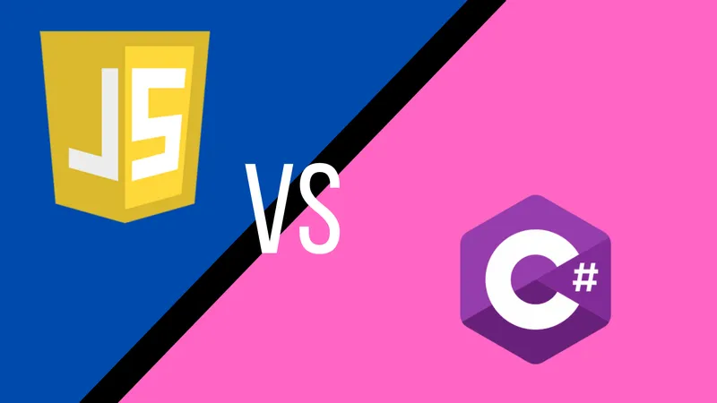

# Introduction to ASP.NET for JavaScript Devs: Building My First Barber App (FYLA: Find Your Local Artist)

### By: Fernando Martinez

Hey everyone! 👋

I'm Fernando, a full-stack developer and Marcy Fellow currently working on my capstone project for the final project of the curriculum. I've been building web apps for a while now, mostly using JavaScript and its ecosystem. But for this project, I wanted to step out of my comfort zone and try something different: ASP.NET with C#.

I've mostly worked with JavaScript, React, Node.js, and Express. But for my capstone project, which is a mobile app for barbers and beauty professionals, I decided to try something new. I picked ASP.NET with C# for my backend. I'm still early in the process, but here's what I've learned so far, and how it compares to the JavaScript stack I'm used to.

---

## Why I'm Learning ASP.NET


I'm Fernando, a full-stack developer and Marcy Fellow currently working on my capstone project for the final project of the curriculum. I've been building web apps for a while now, mostly using JavaScript and its ecosystem. But for this project, I wanted to step out of my comfort zone and try something different: ASP.NET with C#.

I've mostly worked with JavaScript, React, Node.js, and Express. But for my capstone project, which is a mobile app for barbers and beauty professionals, I decided to try something new. I picked ASP.NET with C# for my backend. I'm still early in the process, but here's what I've learned so far, and how it compares to the JavaScript stack I'm used to.

---

### Why I Think It’s Worth Learning:

- **It’s fast:** ASP.NET Core ranks high in backend performance tests.
- **It’s scalable:** Many big companies use it for apps that need to handle a lot of users.
- **It works everywhere:** You can run it on Windows, Mac, or Linux.
- **Security is built-in:** Things like login, authorization, and protection from common attacks are handled well and are easy to implement without extra libraries.

I wanted something solid and production-ready, and ASP.NET felt like a strong choice for an app that handles things like bookings, payments, and chat. It also provides a good foundation if I want to scale it up later.

---

## What ASP.NET Is Used For

People use ASP.NET to build:
- Web apps
- REST APIs
- Microservices
- Real-time apps (like chat)
- Large business applications

It’s used in industries like banking, healthcare, and government. And now—barber shops!

---

## Setting Up ASP.NET

Getting started with ASP.NET felt a little more complex than Express, but once I got the hang of the structure, it made sense.

### To set it up:
1. Install the [.NET SDK](https://dotnet.microsoft.com/download)
2. Create a new API project:
```bash
    dotnet new webapi -n BarberApp.API
```
3. Run it:
```bash
    cd BarberApp.API
    dotnet run
```

You’ll see a sample project with working endpoints right away.

---

## Key Concepts in ASP.NET

Here are a few main parts of the framework I’ve learned:

### 1. **Controllers**
This is where your API routes live, like route files in Express.
```csharp
[ApiController]
[Route("api/[controller]")]
public class AppointmentsController : ControllerBase {
    [HttpGet]
    public IActionResult GetAll() {
        return Ok(new[] {"Cut", "Fade"});
    }
}
```

This code snippet defines a controller for handling appointment-related requests. The `[ApiController]` attribute makes it easier to work with API requests, and the `[Route]` attribute sets the base URL for this controller.

### 2. **Models**
These are just C# classes that represent your data:
```csharp
public class Appointment {
    public int Id { get; set; }
    public string CustomerName { get; set; }
    public DateTime Time { get; set; }
}
```

This snippet defines an `Appointment` model with properties for ID, customer name, and time. Its very similar to how you define models in JavaScript with Mongoose or Sequelize. Just like in JavaScript, these models are used to structure the data you send and receive in your API.

### 3. **Dependency Injection**
ASP.NET uses DI by default. You register services in `Startup.cs` and inject them where you might need them, similar to how you might use middleware in Express. This is how you set up services like repositories or business logic layers:
```csharp
services.AddScoped<IBarberService, BarberService>();
```
This code snippet registers a service that can be injected into controllers or other services. In JavaScript, this would be similar to using a service class and importing it where needed. A service class in ASP.NET is like a module in Node.js that you can import and use throughout your application.

### 4. **Entity Framework Core**
This is the ORM for working with databases. Think Sequelize, but for C#.
```csharp
public class AppDbContext : DbContext {
    public DbSet<Appointment> Appointments { get; set; }
}
```
This code snippet defines a database context that includes a `DbSet` for appointments, allowing you to interact with the database using C# objects.

---

## How React Native Talks to ASP.NET

The frontend of my app is built with React Native. I make HTTP requests to my ASP.NET backend.

Example from the mobile app:
```js
const fetchAppointments = async () => {
  const res = await fetch('https://localhost:5001/api/appointments');
  const data = await res.json();
  setAppointments(data);
};
```

This works the same way it would with Express—make a request, get a JSON response.

---

## ASP.NET vs. Express.js



| Feature           | ASP.NET Core     | Express.js                   |
| ----------------- | ---------------- | ---------------------------- |
| Language          | C#               | JavaScript                   |
| Performance       | Very High        | Moderate to High             |
| Type Safety       | Strong (C#)      | Weak (unless using TS)       |
| Dependency Injection | Built-in     | Manual or 3rd-party          |
| Community         | Enterprise-heavy | Open-source/startup-heavy    |
| Learning Curve    | Steeper          | Beginner-friendly            |

ASP.NET gives you more structure. Express gives you more freedom. One isn’t better than the other—it depends on the project.

---

## My Early Thoughts

- **C# takes getting used to** – It’s strongly typed, so I had to adjust from JavaScript’s flexibility. I was used to dynamic typing, but now I see the benefits of type safety.
- **Setup is heavier** – It’s not as quick to start as Express, but once it’s running, it’s solid. It takes a bit more time to set up, but the structure it provides is worth it.
- **The structure helps** – At first I found it strict, but now I appreciate the organization it encourages. It helps reduce bugs and makes the codebase easier to maintain.

---

## Tips for Beginners (Like Me)

1. Don’t fight the structure—go with it.
2. Use Visual Studio or VS Code for auto-complete and error checking.
3. Learn basic C# concepts like classes, types, and methods.
4. Try Swagger—it’s a tool that lets you test your endpoints easily.
5. Keep comparing things to JavaScript—it helped me learn faster.
6 (THE BIG ONE). If you struggle with strict typing, try learning TypeScript first. It’ll make the transition smoother since TypeScript is statically typed, like C# but with a syntax similar to JavaScript.

---

## Resources I Used

- [ASP.NET Official Docs](https://learn.microsoft.com/en-us/aspnet/core/?view=aspnetcore-6.0)
- [YouTube: IAmTimCorey - ASP.NET Web API](https://www.youtube.com/user/IAmTimCorey)
- [Entity Framework Docs](https://learn.microsoft.com/en-us/ef/core/)
- [C# Programming Guide](https://learn.microsoft.com/en-us/dotnet/csharp/programming-guide/)
---

## Wrapping Up

ASP.NET was a challenge at first because not only did it require I learn a new language, but I also had to learn the framework at the same time. It's a pretty big jump going from exclusively coding in JavaScript, which is dynamically typed, to C#, which is statically typed. 

I’m starting to like C# and ASP.NET. C# is a great language for OOP (object-oriented programming). ASP.NET is fast, structured, and reliable. It works really well with my React Native frontend. If you’re a JavaScript dev and want to try something new for backend development, ASP.NET is worth exploring.

If you have any questions—or tips for someone new to .NET—hit me up!
